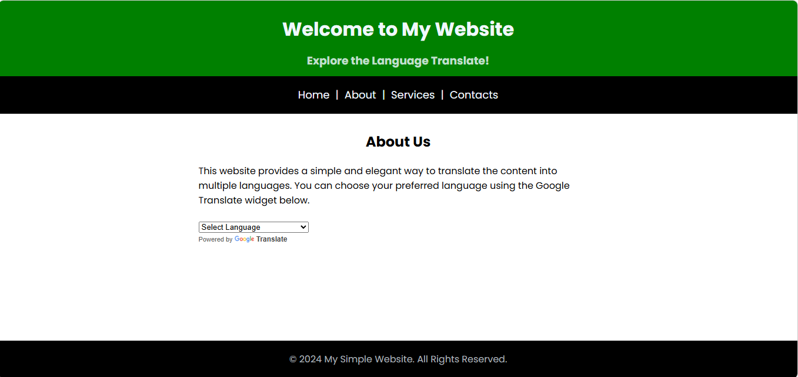
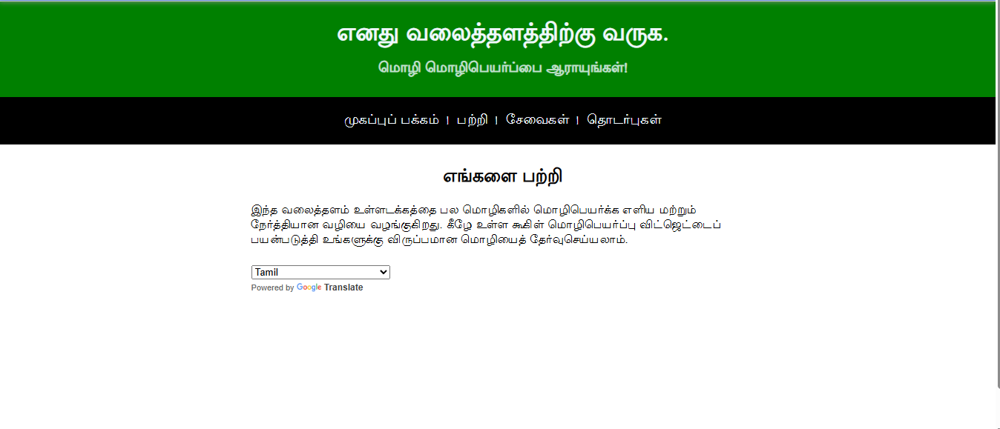

## Language Translator Application

A simple Language Translator Web Application built using HTML, CSS, and JavaScript.
This project allows users to translate text from one language to another using the Google Translate API script.

The application provides an easy-to-use interface where users can enter text, choose a target language, and instantly see the translated result.

## Live Demo
https://sabithra-m.github.io/Language-Translator-Application/

## Project Demo

###Main User Interface

###Language translator app

## Features

- Translate text into multiple languages
- Simple and clean user interface
- Fast translation using Google Translate script
- Responsive design
- Supports many global languages including Tamil, Hindi, Spanish, French, and more

## Built With

- HTML5 – Structure of the application
- CSS3 – Styling and layout
- JavaScript – Application functionality
- Google Translate API Script – Language translation

## How It Works

- User enters text in the input field.
- Selects the desired language.
- The Google Translate script processes the text.
- The translated result is displayed instantly.

## Purpose of the Project

- This project was created to practice:
- JavaScript DOM manipulation
- Using external scripts
- Building simple interactive web applications

## Future Improvements

- Voice input for translation
- Copy translated text button
- Dark mode support
- Improved UI design
